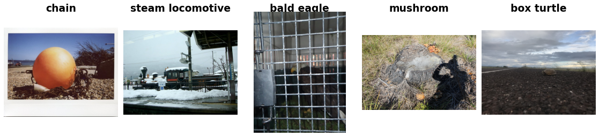

ImageNet-A
==========

.. raw:: html

   

   
   
   
   
   

Overview
--------

ImageNet-A is a benchmark of natural adversarial examples: real-world, unmodified photos from 200 ImageNet classes that standard ImageNet classifiers misclassify. The photos look ordinary to people, but contain cues (unusual angles, cluttered backgrounds, misleading objects) that cause models to fail, so the dataset measures robustness to naturally occurring hard examples rather than to synthetic corruptions.

- **Test**: 7,500 images across 200 classes (the number of images per class varies)
- **Train**: N/A (test-only dataset for robustness evaluation)

Each of the 200 classes is one of the 1,000 ImageNet-1K classes. Labels are numbered 0-199 within ImageNet-A, and a mapping to ImageNet-1K indices is provided so that a standard 1000-way ImageNet classifier can be evaluated directly.

Data Structure
--------------

When accessing an example using ``ds[i]``, you will receive a dictionary with the following keys:

.. list-table::
   :header-rows: 1
   :widths: 20 20 60

   * - Key
     - Type
     - Description
   * - ``image``
     - ``PIL.Image.Image``
     - RGB photo (variable size)
   * - ``label``
     - int
     - Class label (0-199)

Classes and Label Mapping
-------------------------

The classes are sorted by WordNet ID, which is the same order as ImageNet-1K. The module ``stable_datasets.images.imagenet_a`` exposes three lists, all indexed by the ImageNet-A label:

- ``IMAGENET_A_CLASS_NAMES``: readable class names (also available as ``ds.info.features["label"].names``)
- ``IMAGENET_A_WNIDS``: WordNet IDs
- ``IMAGENET_A_TO_IN1K``: the index of each class in ImageNet-1K

.. list-table::
   :header-rows: 1
   :widths: 15 30 25 30

   * - Label
     - Class Name
     - WordNet ID
     - ImageNet-1K Index
   * - 0
     - stingray
     - ``n01498041``
     - 6
   * - 1
     - goldfinch
     - ``n01531178``
     - 11
   * - ...
     - ...
     - ...
     - ...
   * - 98
     - chain
     - ``n02999410``
     - 488
   * - ...
     - ...
     - ...
     - ...
   * - 199
     - acorn
     - ``n12267677``
     - 988

Why Test-Only?
--------------

ImageNet-A was released as an evaluation set only. It is meant to measure how models trained on ImageNet-1K generalize to hard, naturally occurring examples, so it is never used for training. The intended protocol is to take a classifier trained on ImageNet-1K, keep only the outputs of the 200 ImageNet-A classes (using ``IMAGENET_A_TO_IN1K``), and report top-1 accuracy on the 7,500 images.

Usage Example
-------------

**Basic Usage**

.. code-block:: python

    from stable_datasets.images.imagenet_a import ImageNetA

    # First run will download + prepare cache, then return the split
    ds = ImageNetA(split="test")

    # If you omit the split (split=None), you get a DatasetDict with the single "test" split
    ds_all = ImageNetA(split=None)

    sample = ds[0]
    print(sample.keys())  # {"image", "label"}

    class_names = ds.info.features["label"].names
    print(class_names[sample["label"]])  # e.g. "chain"

    # Optional: make it PyTorch-friendly
    ds_torch = ds.with_format("torch")

**Evaluating an ImageNet-1K Classifier**

.. code-block:: python

    import torch
    from torchvision.models import ResNet50_Weights, resnet50

    from stable_datasets.images.imagenet_a import IMAGENET_A_TO_IN1K, ImageNetA

    weights = ResNet50_Weights.IMAGENET1K_V1
    model = resnet50(weights=weights).eval()
    preprocess = weights.transforms()

    ds = ImageNetA(split="test")
    correct = 0
    with torch.no_grad():
        for sample in ds:
            logits = model(preprocess(sample["image"]).unsqueeze(0))
            # Keep only the 200 ImageNet-A classes, then take the most likely one
            prediction = logits[:, IMAGENET_A_TO_IN1K].argmax(dim=1).item()
            correct += int(prediction == sample["label"])

    print(f"Top-1 accuracy: {correct / len(ds):.2%}")

Related Datasets
----------------

- :doc:`tiny_imagenet_c`: Common corruptions applied to Tiny ImageNet
- :doc:`cifar10_c`: Common corruptions applied to CIFAR-10
- :doc:`cifar100_c`: Common corruptions applied to CIFAR-100

References
----------

- Paper: Natural Adversarial Examples (CVPR 2021)
- Official repository: https://github.com/hendrycks/natural-adv-examples
- Dataset download: https://people.eecs.berkeley.edu/~hendrycks/imagenet-a.tar
- License: MIT License (per the authors' GitHub repository)

Citation
--------

.. code-block:: bibtex

    @article{hendrycks2021nae,
      title={Natural Adversarial Examples},
      author={Dan Hendrycks and Kevin Zhao and Steven Basart and Jacob Steinhardt and Dawn Song},
      journal={CVPR},
      year={2021}
    }
