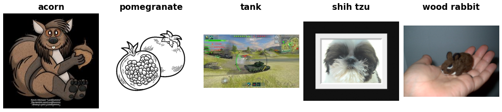

ImageNet-R
==========

.. raw:: html

   

   
   
   
   
   

Overview
--------

ImageNet-R (ImageNet-Renditions) is a benchmark of artistic and stylized renditions of 200 ImageNet classes: art, cartoons, deviantart, graffiti, embroidery, graphics, origami, paintings, patterns, plastic objects, plush objects, sculptures, sketches, tattoos, toys, and video games. The objects are the same as in ImageNet, but their appearance (texture, color, and style) is very different from the photos a standard classifier is trained on, so the dataset measures robustness to changes in image style.

- **Test**: 30,000 images across 200 classes (the number of images per class varies, from 51 to 430)
- **Train**: N/A (test-only dataset for robustness evaluation)

Each of the 200 classes is one of the 1,000 ImageNet-1K classes. Labels are numbered 0-199 within ImageNet-R, and a mapping to ImageNet-1K indices is provided so that a standard 1000-way ImageNet classifier can be evaluated directly.

Data Structure
--------------

When accessing an example using ``ds[i]``, you will receive a dictionary with the following keys:

.. list-table::
   :header-rows: 1
   :widths: 20 20 60

   * - Key
     - Type
     - Description
   * - ``image``
     - ``PIL.Image.Image``
     - RGB image (variable size)
   * - ``label``
     - int
     - Class label (0-199)

About 4% of the images in the original archive are grayscale or CMYK. They are converted to RGB (and their embedded color profiles are dropped), so every image is returned as RGB. All other images keep their original JPEG bytes.

Renditions
----------

The official README describes the renditions as art, cartoons, deviantart, graffiti, embroidery, graphics, origami, paintings, patterns, plastic objects, plush objects, sculptures, sketches, tattoos, toys, and video games.

Each file in the archive is named after the search query used to collect it, for example ``cartoon_12.jpg`` or ``sketch_0.jpg``. The README notes that this name is only a noisy indicator of the image's rendition style, so it is not exposed as a field. For reference, the archive contains these file-name keywords:

.. list-table::
   :header-rows: 1
   :widths: 40 30

   * - File-name keyword
     - Images
   * - ``misc``
     - 5,673
   * - ``sketch``
     - 4,634
   * - ``cartoon``
     - 3,726
   * - ``painting``
     - 2,835
   * - ``deviantart``
     - 2,163
   * - ``tattoo``
     - 1,947
   * - ``art``
     - 1,528
   * - ``toy``
     - 1,511
   * - ``videogame``
     - 1,422
   * - ``sculpture``
     - 1,196
   * - ``graffiti``
     - 941
   * - ``embroidery``
     - 722
   * - ``graphic``
     - 644
   * - ``origami``
     - 550
   * - ``sticker``
     - 508

Classes and Label Mapping
-------------------------

The classes are sorted by WordNet ID, which is the same order as ImageNet-1K. The module ``stable_datasets.images.imagenet_r`` exposes three lists, all indexed by the ImageNet-R label:

- ``IMAGENET_R_CLASS_NAMES``: readable class names (also available as ``ds.info.features["label"].names``)
- ``IMAGENET_R_WNIDS``: WordNet IDs
- ``IMAGENET_R_TO_IN1K``: the index of each class in ImageNet-1K

.. list-table::
   :header-rows: 1
   :widths: 15 30 25 30

   * - Label
     - Class Name
     - WordNet ID
     - ImageNet-1K Index
   * - 0
     - goldfish
     - ``n01443537``
     - 1
   * - 1
     - great white shark
     - ``n01484850``
     - 2
   * - ...
     - ...
     - ...
     - ...
   * - 3
     - stingray
     - ``n01498041``
     - 6
   * - ...
     - ...
     - ...
     - ...
   * - 199
     - acorn
     - ``n12267677``
     - 988

ImageNet-R shares 86 of its 200 classes with :doc:`imagenet_a`, but each dataset numbers its own classes: stingray is label 3 here and label 0 in ImageNet-A, while its ImageNet-1K index is 6 in both. Class names are taken from each dataset's official README, and 10 of the shared classes are named differently (for example, "hotdog" here and "hot dog" in ImageNet-A). Use the WordNet IDs or the ImageNet-1K indices to match classes across the two datasets.

Why Test-Only?
--------------

ImageNet-R was released as an evaluation set only. It is meant to measure how models trained on ImageNet-1K generalize to new image styles, so it is never used for training. The intended protocol is to take a classifier trained on ImageNet-1K, keep only the outputs of the 200 ImageNet-R classes (using ``IMAGENET_R_TO_IN1K``), and report top-1 accuracy on the 30,000 images.

Usage Example
-------------

**Basic Usage**

.. code-block:: python

    from stable_datasets.images.imagenet_r import ImageNetR

    # First run will download + prepare cache, then return the split
    ds = ImageNetR(split="test")

    # If you omit the split (split=None), you get a DatasetDict with the single "test" split
    ds_all = ImageNetR(split=None)

    sample = ds[0]
    print(sample.keys())  # {"image", "label"}

    class_names = ds.info.features["label"].names
    print(class_names[sample["label"]])  # e.g. "acorn"

    # Optional: make it PyTorch-friendly
    ds_torch = ds.with_format("torch")

**Evaluating an ImageNet-1K Classifier**

.. code-block:: python

    import torch
    from torchvision.models import ResNet50_Weights, resnet50

    from stable_datasets.images.imagenet_r import IMAGENET_R_TO_IN1K, ImageNetR

    weights = ResNet50_Weights.IMAGENET1K_V1
    model = resnet50(weights=weights).eval()
    preprocess = weights.transforms()

    ds = ImageNetR(split="test")
    correct = 0
    with torch.no_grad():
        for sample in ds:
            logits = model(preprocess(sample["image"]).unsqueeze(0))
            # Keep only the 200 ImageNet-R classes, then take the most likely one
            prediction = logits[:, IMAGENET_R_TO_IN1K].argmax(dim=1).item()
            correct += int(prediction == sample["label"])

    print(f"Top-1 accuracy: {correct / len(ds):.2%}")

Related Datasets
----------------

- :doc:`imagenet_a`: Natural adversarial examples for 200 ImageNet classes
- :doc:`tiny_imagenet_c`: Common corruptions applied to Tiny ImageNet
- :doc:`cifar10_c`: Common corruptions applied to CIFAR-10
- :doc:`cifar100_c`: Common corruptions applied to CIFAR-100

References
----------

- Paper: The Many Faces of Robustness: A Critical Analysis of Out-of-Distribution Generalization (ICCV 2021)
- Official repository: https://github.com/hendrycks/imagenet-r
- Dataset download: https://people.eecs.berkeley.edu/~hendrycks/imagenet-r.tar
- License: MIT License (per the authors' GitHub repository)

Citation
--------

.. code-block:: bibtex

    @article{hendrycks2021many,
      title={The Many Faces of Robustness: A Critical Analysis of Out-of-Distribution Generalization},
      author={Dan Hendrycks and Steven Basart and Norman Mu and Saurav Kadavath and Frank Wang and Evan Dorundo and Rahul Desai and Tyler Zhu and Samyak Parajuli and Mike Guo and Dawn Song and Jacob Steinhardt and Justin Gilmer},
      journal={ICCV},
      year={2021}
    }
